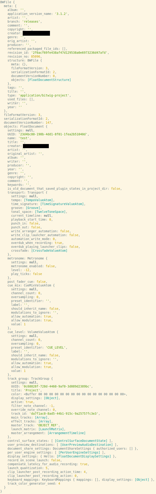

# Bitwig File Parser
_proof of concept. not for production_


## usage
```
$ git clone https://github.com/alangecker/bitwig-parser.git
$ cd bitwig-parser
$ yarn install
$ yarn decode-file example.bwproject
```

## output
